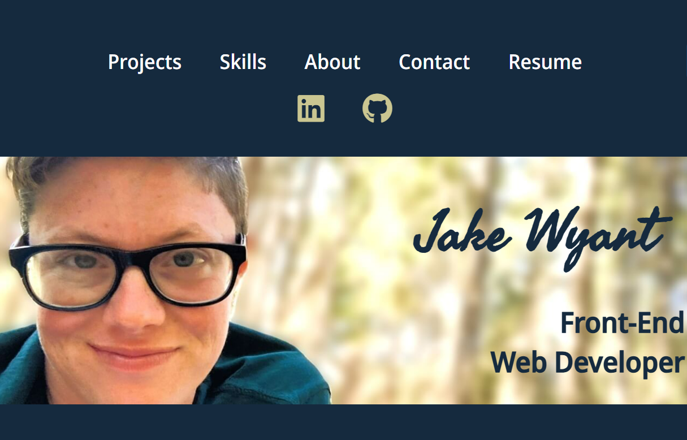

# Protfolio

- [Overview](#overview)
  - [Screenshot](#screenshot)
  - [Links](#links)
- [My process](#my-process)
  - [Built with](#built-with)
  - [What I learned](#what-i-learned)
  - [Continued development](#continued-development)
  - [Useful resources](#useful-resources)
- [Author](#author)
- [Acknowledgments](#acknowledgments)

## Overview
- I am a Frontend Web Developer based in the Greater Philadelphia area. I am proficient in HTML5, CSS, Bootstrap5, Vanilla JavaScript, React.js, and am currently working with WordPress. I look forward to collaborating with individuals or companies to create inovative solutions to everyday problems especially those facing today's educators.

### Screenshot

### Links
- Solution URL:
 https://github.com/Dev-Wy/Portfolio/
- Live Site URL:
 https://dev-wy.github.io/Portfolio/

## My Process
### Built with
- HTML
- CSS
- JavaScript

### What I learned
-  I learned how to align items and organize them while adjusting for a variety of screen sizes.

### Continued development
- I would like o add animations and the additional skills I have picked up over the last few months. 

### Useful Resources: 
- I love W3C School's validation services. 
- https://validator.w3.org/   
- https://jigsaw.w3.org/css-validator/

## Author
- Jake Wyant
- Portfolio: https://dev-wy.github.io/Portfolio/
- https://forum.freecodecamp.org/u/dev-wy/summary

## Acknowledgments
- W3C for their resources. 
- Special thanks to Skillcrush for giving me the foundation to build on.
